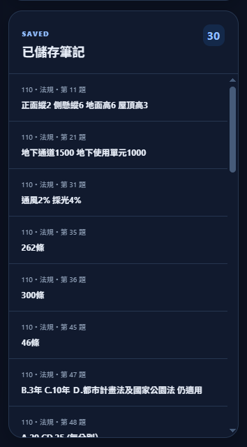
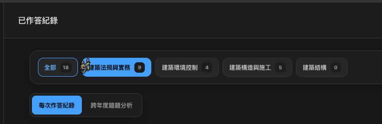
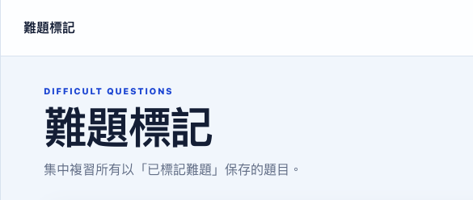

# 需求 1.5

 手機版作答頁面 題號導覽應該放在最下面，使用者能在頁面直接作答不需要滾動
 選擇答案刪除，答案區塊匡只要四個選項匡其他匡都刪除
 作答結果顯示每次的分數
本回作答結果字刪除 分數外環應該是佔比要符合分數
 難題標記也要分科目類別，再進去分年份
所有分頁的上方大字標題全部刪除（保留最上方小字就好），讓每個頁面都可以一目瞭然功能，刪除所有冗言贅字
 選項有綠色即可，下面正確答案那行刪除
 藍色正確答案區塊不用重複正確答案，直接變成詳解區塊就好
