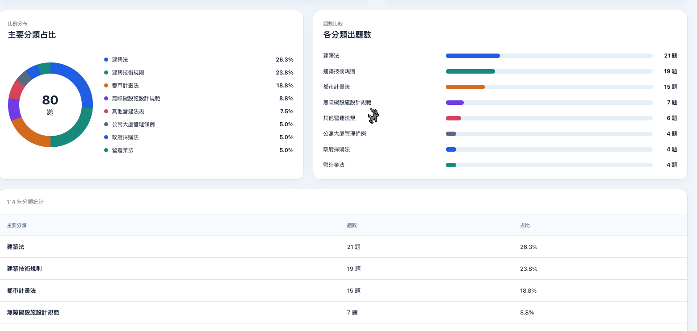
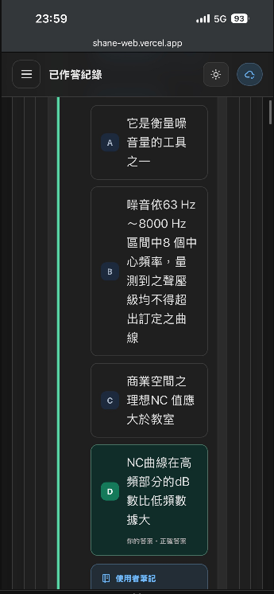

# Todo

已完成的需求請見[歷史紀錄](歷史紀錄/todo-歷史紀錄.md)。
尚待確認的需求請見[待討論](待討論/todo-待討論.md)。

## 1.33 - 2026-08-13

狀態：已實作待審核

- [x]  放大逐題作答結果中的題號資訊
- [x]  右側題號索引跟隨目前檢視的題目並自動捲動

## 1.34 - 2026-08-13

狀態：已實作待審核

- [x]  使用者討論文字刪除，直接顯示內容就好
- [x]  第 16 題題號重複，可刪除
- [x]  詳解與討論題目前要有題號
- [x]  詳解討論的解題觀念分享欄位移到共享內容下面大一點，且也支援粗體
- [x]  自己放的詳解支援編輯內容

## 1.35 - 2026-08-14

狀態：已實作待審核

- [x]  修正顯示詳解時文字被擠成直向排列的問題
- [x]  使用者筆記管理頁與逐題作答結果皆加入格式預覽，正確顯示粗體效果

## 1.36 - 2026-08-16

狀態：已實作待審核

- [x]  修正手機版完整作答紀錄層層內縮，導致題目選項過窄難以閱讀的問題
