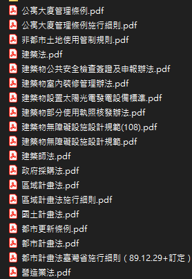
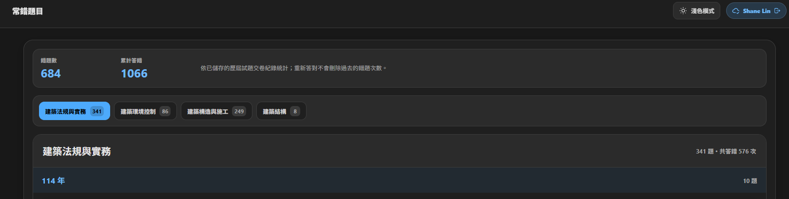
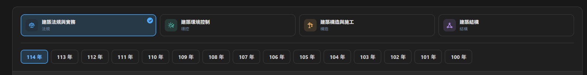
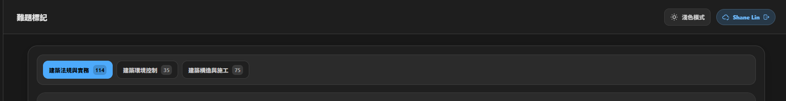
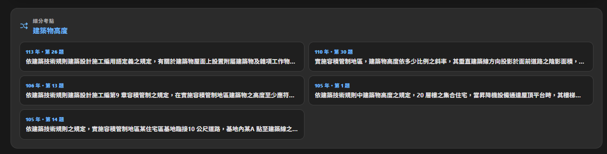
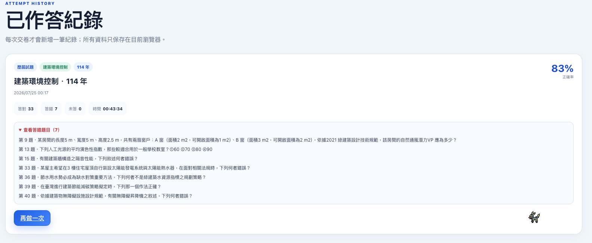
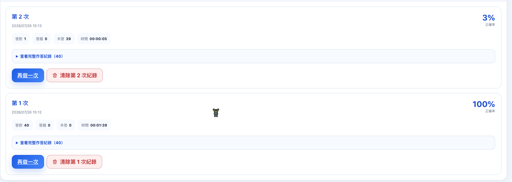

# Todo

已完成的需求請見[歷史紀錄](歷史紀錄/todo-歷史紀錄.md)。
尚待確認的需求請見[待討論](待討論/todo-待討論.md)。

## 1.37 - 2026-08-17

狀態：已實作待審核

- [x] 歷屆試題作答新增保留功能，使用者做到一半離開後，下次回到網頁可以繼續完成未完成的題目。
- [x] 檢討題目時如果進入詳解與討論，按上一頁要回到檢討題目頁面，而非一般作答題目。

## 1.38 - 2026-08-17

狀態：已實作待審核

- [x]  使用者筆記與詳解討論皆顯示該題分類，呈現方式與作答頁一致

## 1.39 - 2026-08-17

狀態：已實作待審核

- [x]  移除獨立的格式預覽，文字輸入新增斜體、上標、下標與紅字格式。

## 1.40 - 2026-08-18

狀態：已實作待審核

- [x]  使用粗體等格式功能時保留輸入區捲動位置，不再跳至最頂。
- [x]  同一使用者分享的詳解不重複刊登，新的修正直接取代原內容。

## 1.41 - 2026-08-23

狀態：已實作待審核

- [x] 作答紀錄比較同年度每次作答錯題，同題重複答錯時標記累計答錯次數。
- [x] 法規題依題幹與選項語意判斷細分考點，在使用者筆記、詳解與討論底部顯示同考點的類似題目。

## 1.42 - 2026-08-24

狀態：已實作待審核

- [x]   題庫部分年度載入失敗時，使用者筆記與詳解討論仍可使用已成功載入的題目。

## 1.43 - 2026-08-24

狀態：已實作待審核

- [x]  修復已作答紀錄題庫載入失敗，縮短單年度題庫在正式環境的讀取時間。
- [x]   使用者筆記與難題標記只載入實際需要的年度，避免其他年度失敗阻斷內容顯示。

### 追加修正

- [x]  作答檢討顯示時即預先讀取各題詳解與討論，展開後直接呈現相關投稿。
- [x]  難題標記分類移除「全部」，預設顯示第一個有標記題目的科目。

## 1.44 - 2026-08-24

狀態：已實作待審核

- [x]  修正作答紀錄誤判已完成所有年度；做到 105 年後，依題庫收錄順序繼續顯示 104、103、102 年。

## 1.45 - 2026-08-25

狀態：已實作待審核

- [x]  題號導覽完整顯示不要滾動，並壓縮下方使用者筆記輸入區。
- [x]  修正難題標記裡面分享詳解失敗。

### 追加修正

- [x] 使用者筆記頁的題號導覽移除高度限制與內部捲動，完整呈現該年度所有題號。
<<<<<<< HEAD
- [x] 修正既有詳解更新遭 Firestore 權限拒絕時分享失敗，改以新版替代投稿相容線上舊規則。
=======
- [x] 隨機出題新增「打亂選項」勾選功能；同一題組的選項順序保持穩定，答案仍依原始選項正確計分與保存。
>>>>>>> 86342852507acf9707ca6ba3f0ef610dc2dfdf56
