# Todo

已完成的需求請見[歷史紀錄](歷史紀錄/todo-歷史紀錄.md)。
尚待確認的需求請見[待討論](待討論/todo-待討論.md)。

## 1.47 - 2026-09-04

狀態：已實作待審核

- [x] 作者分類管理新增獨立的「類似題目細分考點」，可人工校正類似題目的配對準確性，且不影響原本的大分類。
- [x] 相同細分考點的法規題互相配對；人工分類優先，尚未分類時保留關鍵字自動判斷。
- [x] 新增「類似題目尚未人工分類」篩選，方便逐題完成細項分類。

## 1.48 - 2026-09-08

狀態：已實作待審核

- [x] 考題分析新增可收合的詳細趨勢分析，使用折線圖跨年度比較各科目分類的出題數量。
- [x] 使用者可自行勾選最多六個法規或分類進行比較，並可查看各年度精確題數表。
- [x] 法規科目可切換比較「法規分類」或「人工細分考點」。
- [x] 整合選取項目總標註數、最高單年出題量及首末年度變化最大項目等統計摘要。

## 1.49 - 2026-09-08

狀態：已實作待審核

- [x] 考題分析新增「115 年複習優先度」，依近期加權頻率、近五年覆蓋率、升降趨勢與長期平均排列考點。
- [x] 提供 0～100 優先指數、近三年加權題數、近期動能、最近出題年度與可解釋的趨勢標籤。
- [x] 顯示人工細分考點資料覆蓋率，並註明結果是複習資源排序而非命題機率。

## 1.50 - 2026-09-09

狀態：已實作待審核

- [x] 折線圖在未勾選分類時保留空白圖表與固定位置，勾選後即時呈現，避免頁面跳動。
- [x] 折線圖標示縱軸「出題數（題）」與橫軸「年份」。
- [x] 縱軸題數以 1 題為間隔顯示刻度及格線。
- [x] 詳細趨勢分析提供獨立的起訖年度選擇，折線圖、統計摘要與預測排名同步套用所選區間。

## 1.51 - 2026-09-09

狀態：已實作待審核

- [x] 使用者筆記加入難題標記按鈕，並與題號導覽及既有難題清單同步狀態。
- [x] 新增「常錯題目」頁面，依歷屆試題交卷紀錄統整錯題與累計答錯次數，並提供科目、年度、重作、詳解、筆記及難題標記功能。
- [x] 登入後同步題目／選項字體大小、淺深模式與自訂介面配色，讓設定跟隨 Firebase 帳號套用至不同裝置。

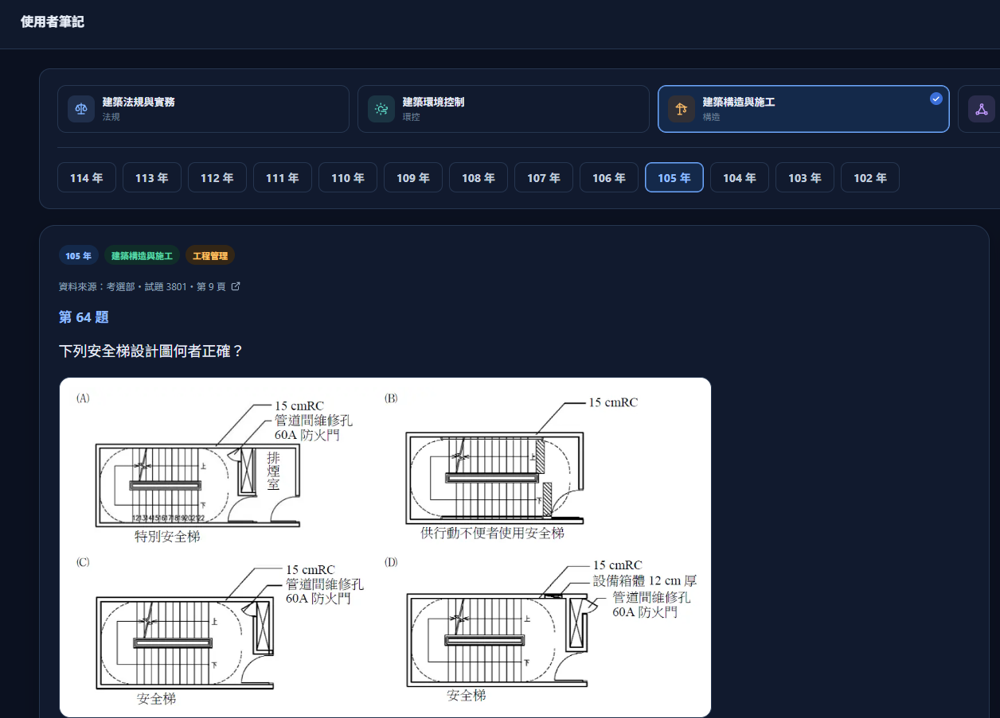
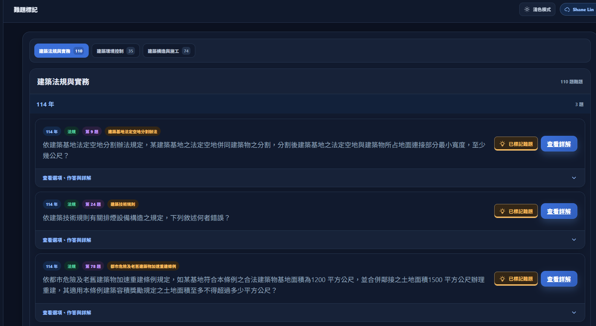
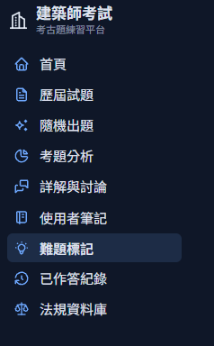
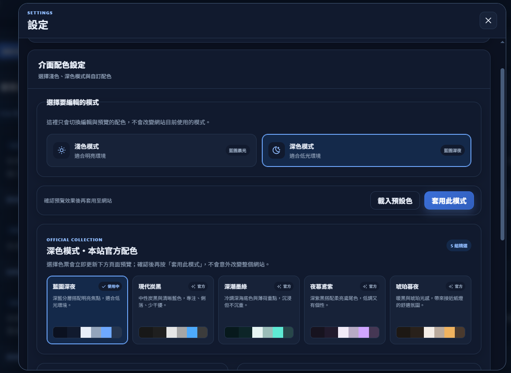

## 1.52 - 2026-09-09

狀態：已實作待審核

- [x] 閱讀截圖列出的建築相關法規及設計規範，建立後續內容校正所需的法規架構。
- [x] 整理 19 份文件的官方來源、核心範圍及版本注意事項至 `ref/building-law-reading-index.md`。
- [x] 標註國土計畫轉軌、太陽光電新制、無障礙歷史版本及臺灣省施行細則等易誤用處。

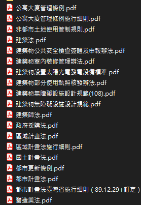

## 1.53 - 2026-09-21

狀態：已實作待審核

- [x] 常錯題目與難題標記改用和歷屆試題一致的科目卡片及年度按鈕，並只顯示目前選取年度的題目。
- [x] 類似題目區塊的「細分考點」標籤改為「類似考題」。

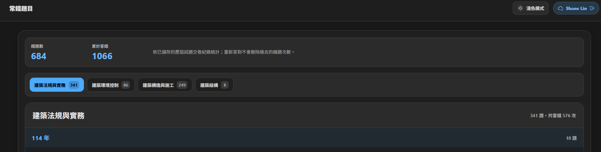
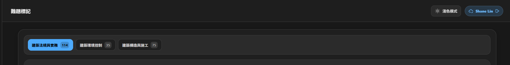
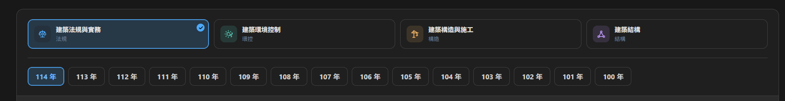
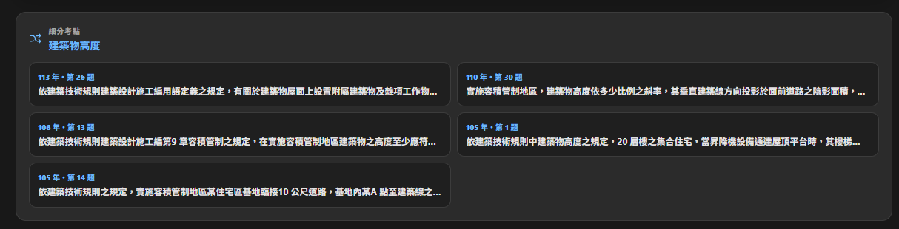

## 1.54 - 2026-10-07

狀態：已實作待審核

- [x] 新增獨立的「每日練習」功能，可複選科目，並由各科題庫分別隨機抽出 50 題。
- [x] 每科分為十層、每層五題，以關卡地圖、即時進度與答題統計呈現遊戲化流程。
- [x] 每層結束強制檢討該層錯題；單輪累積三題錯誤時立即暫停作答，完成逐題檢討後才能繼續。
- [x] 保存當日題組、作答與檢討進度，重新整理後可繼續，且不修改既有作答功能。

## 1.55 - 2026-10-07

狀態：已實作待審核

- [x] 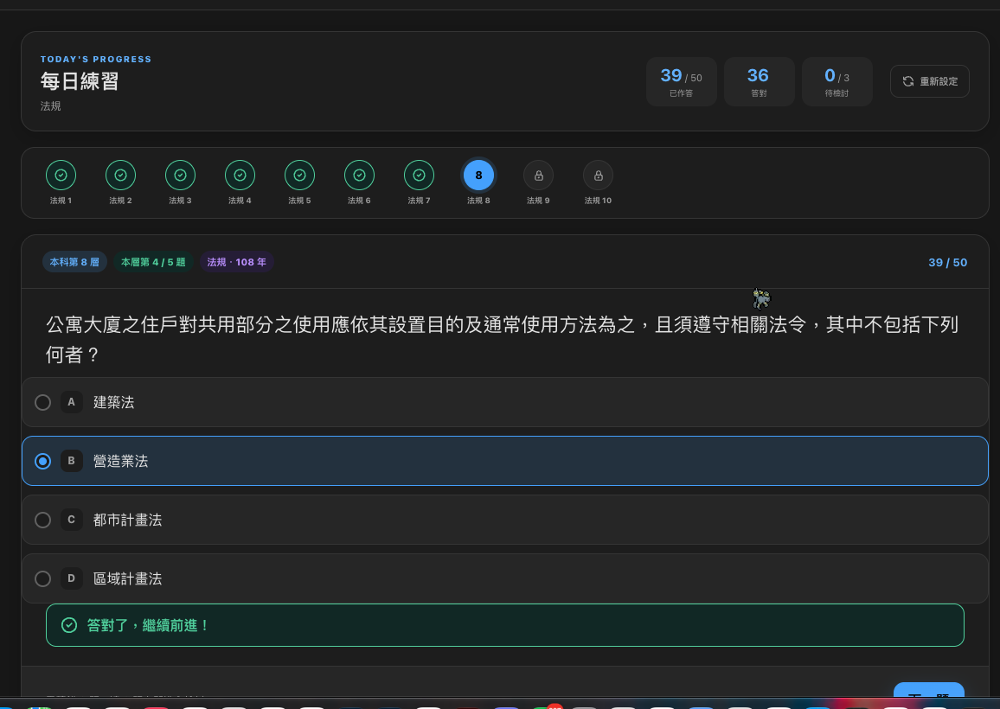 壓縮作答頁高度，避免主要操作區在一般桌面尺寸被切到。
- [x] 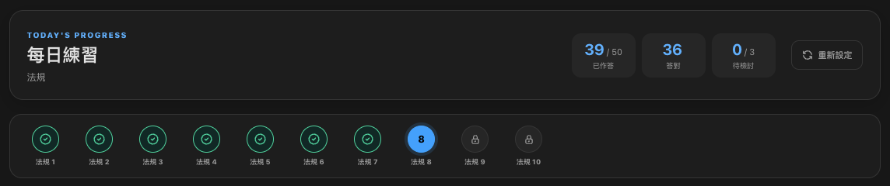 移除重複的每日練習資訊卡，將目前科目的十層關卡、作答統計及重新選科整合為單列。
- [x] 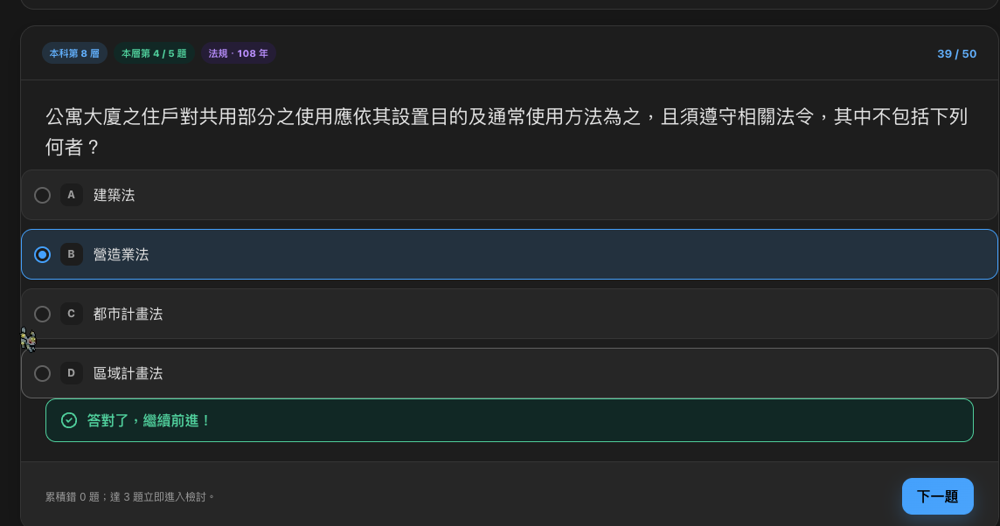 答對或答錯後以整張題目卡框線顯示狀態，放大下一題按鈕並靠右排列。
- [x] 每日練習加入刪除／恢復選項功能及難題標記。
- [x] 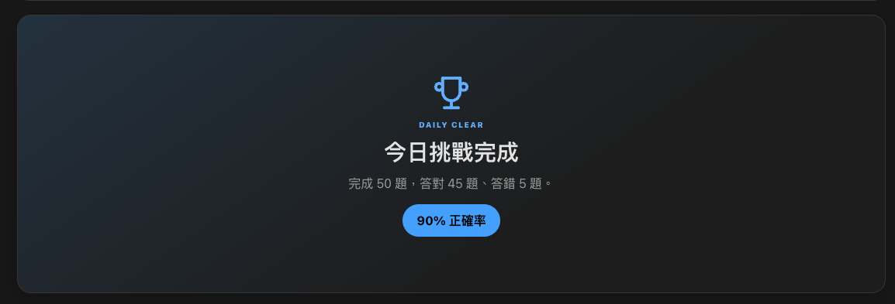 單科完成頁新增錯題清單，集中顯示作答選項、正確答案及詳解。
- [x] 單科完成後鎖定至隔日，並可返回選擇其他尚未完成的科目；複選科目時每完成一科皆先顯示成果。

## 1.56 - 2026-10-08

狀態：已實作待審核

- [x] 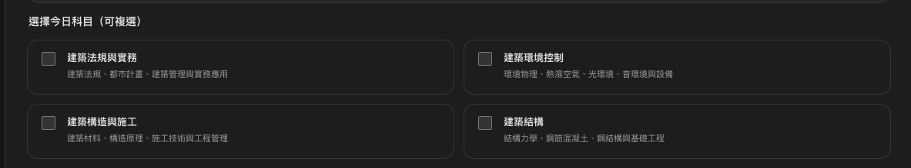 每次只選擇一個科目，各科分別建立獨立的 50 題每日練習，不使用複選合併出題。
- [x]  移除答對後重複顯示的提示列，保留整張題目卡的答對狀態。
- [x] 錯題檢討時可直接新增、編輯及儲存使用者筆記。
- [x] 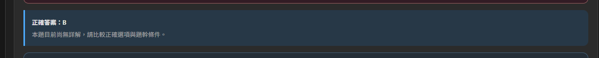  累積答錯達三題時，立即結束該科當日練習並鎖定至隔日；完成分層檢討後仍保留整場累積答錯數。
- [x] 每日練習不顯示題目年份，且每場題目的選項順序隨機打亂並隨進度保存。
- [x] 題目與完成狀態於台北時間每日零點換日刷新，不以開始後 24 小時計算。
