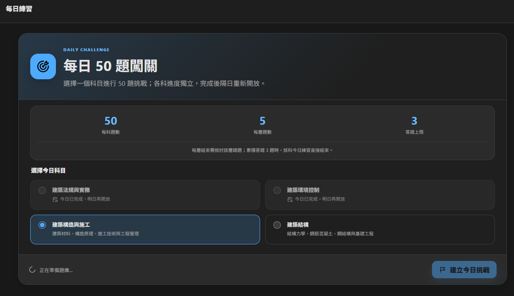
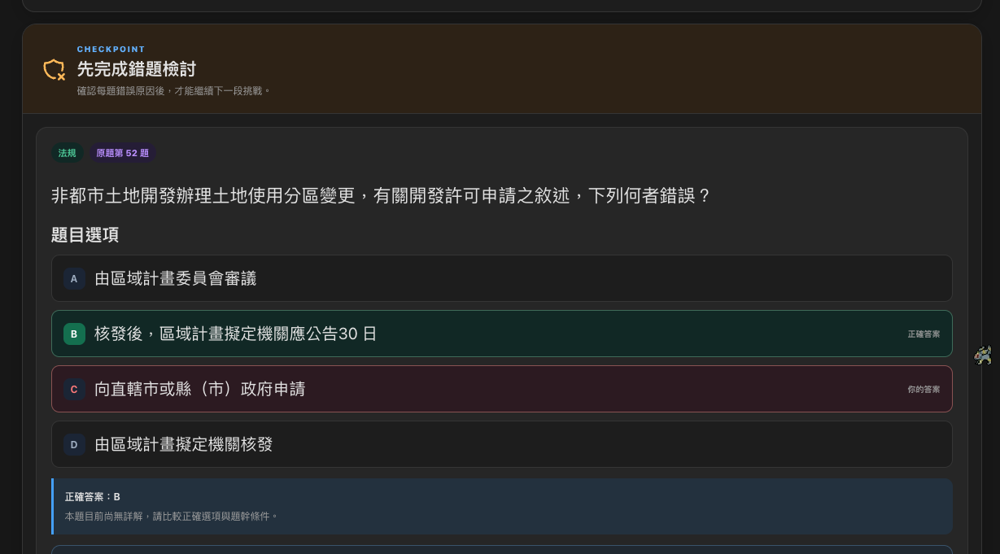
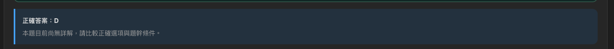
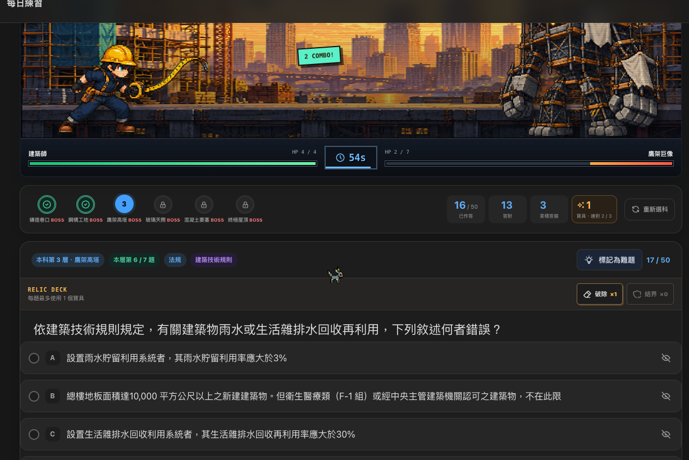
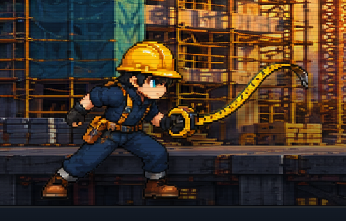
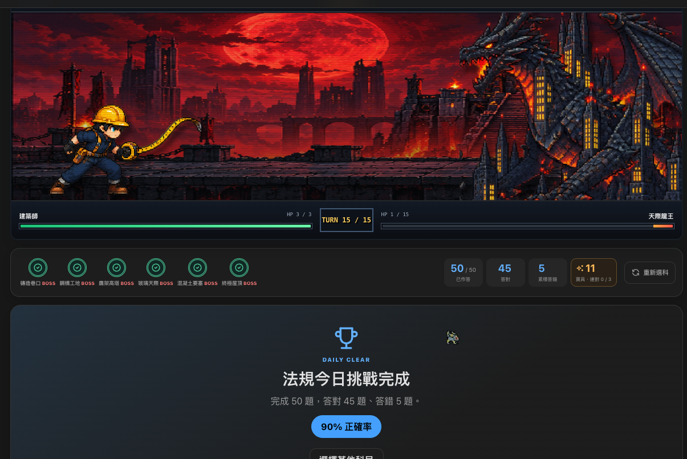
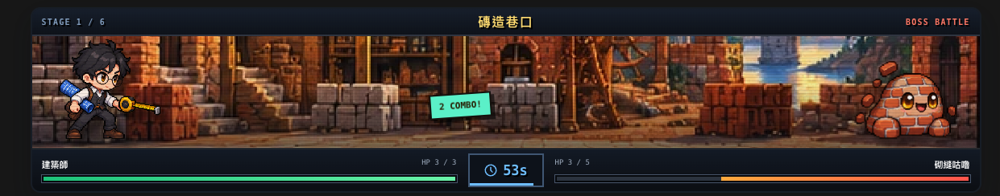
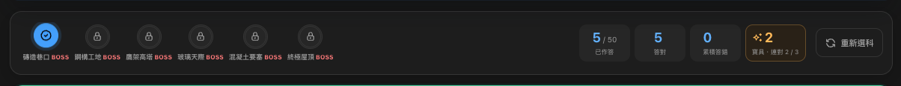
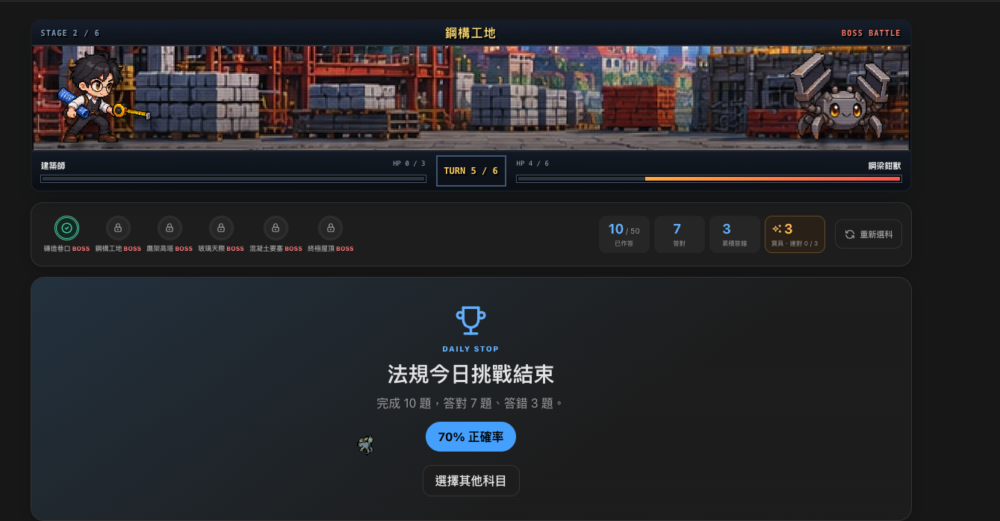

# Todo

已完成的需求請見[歷史紀錄](歷史紀錄/todo-歷史紀錄.md)。
尚待確認的需求請見[待討論](待討論/todo-待討論.md)。

## 1.47 - 2026-09-04

狀態：已實作待審核

- [x] 作者分類管理新增獨立的「類似題目細分考點」，可人工校正類似題目的配對準確性，且不影響原本的大分類。
- [x] 相同細分考點的法規題互相配對；人工分類優先，尚未分類時保留關鍵字自動判斷。
- [x] 新增「類似題目尚未人工分類」篩選，方便逐題完成細項分類。

## 1.48 - 2026-09-08

狀態：已實作待審核

- [x] 考題分析新增可收合的詳細趨勢分析，使用折線圖跨年度比較各科目分類的出題數量。
- [x] 使用者可自行勾選最多六個法規或分類進行比較，並可查看各年度精確題數表。
- [x] 法規科目可切換比較「法規分類」或「人工細分考點」。
- [x] 整合選取項目總標註數、最高單年出題量及首末年度變化最大項目等統計摘要。

## 1.49 - 2026-09-08

狀態：已實作待審核

- [x] 考題分析新增「115 年複習優先度」，依近期加權頻率、近五年覆蓋率、升降趨勢與長期平均排列考點。
- [x] 提供 0～100 優先指數、近三年加權題數、近期動能、最近出題年度與可解釋的趨勢標籤。
- [x] 顯示人工細分考點資料覆蓋率，並註明結果是複習資源排序而非命題機率。

## 1.50 - 2026-09-09

狀態：已實作待審核

- [x] 折線圖在未勾選分類時保留空白圖表與固定位置，勾選後即時呈現，避免頁面跳動。
- [x] 折線圖標示縱軸「出題數（題）」與橫軸「年份」。
- [x] 縱軸題數以 1 題為間隔顯示刻度及格線。
- [x] 詳細趨勢分析提供獨立的起訖年度選擇，折線圖、統計摘要與預測排名同步套用所選區間。

## 1.51 - 2026-09-09

狀態：已實作待審核

- [x] 使用者筆記加入難題標記按鈕，並與題號導覽及既有難題清單同步狀態。
- [x] 新增「常錯題目」頁面，依歷屆試題交卷紀錄統整錯題與累計答錯次數，並提供科目、年度、重作、詳解、筆記及難題標記功能。
- [x] 登入後同步題目／選項字體大小、淺深模式與自訂介面配色，讓設定跟隨 Firebase 帳號套用至不同裝置。

## 1.52 - 2026-09-09

狀態：已實作待審核

- [x] 閱讀截圖列出的建築相關法規及設計規範，建立後續內容校正所需的法規架構。
- [x] 整理 19 份文件的官方來源、核心範圍及版本注意事項至 `ref/building-law-reading-index.md`。
- [x] 標註國土計畫轉軌、太陽光電新制、無障礙歷史版本及臺灣省施行細則等易誤用處。

## 1.53 - 2026-09-21

狀態：已實作待審核

- [x] 常錯題目與難題標記改用和歷屆試題一致的科目卡片及年度按鈕，並只顯示目前選取年度的題目。
- [x] 類似題目區塊的「細分考點」標籤改為「類似考題」。

## 1.54 - 2026-10-07

狀態：已實作待審核

- [x] 新增獨立的「每日練習」功能，可複選科目，並由各科題庫分別隨機抽出 50 題。
- [x] 每科分為十層、每層五題，以關卡地圖、即時進度與答題統計呈現遊戲化流程。
- [x] 每層結束強制檢討該層錯題；單輪累積三題錯誤時立即暫停作答，完成逐題檢討後才能繼續。
- [x] 保存當日題組、作答與檢討進度，重新整理後可繼續，且不修改既有作答功能。

## 1.55 - 2026-10-07

狀態：已實作待審核

- [x]  壓縮作答頁高度，避免主要操作區在一般桌面尺寸被切到。
- [x]  移除重複的每日練習資訊卡，將目前科目的十層關卡、作答統計及重新選科整合為單列。
- [x]  答對或答錯後以整張題目卡框線顯示狀態，放大下一題按鈕並靠右排列。
- [x] 每日練習加入刪除／恢復選項功能及難題標記。
- [x]  單科完成頁新增錯題清單，集中顯示作答選項、正確答案及詳解。
- [x] 單科完成後鎖定至隔日，並可返回選擇其他尚未完成的科目；複選科目時每完成一科皆先顯示成果。

## 1.56 - 2026-10-08

狀態：已實作待審核

- [x]  每次只選擇一個科目，各科分別建立獨立的 50 題每日練習，不使用複選合併出題。
- [x]  移除答對後重複顯示的提示列，保留整張題目卡的答對狀態。
- [x] 錯題檢討時可直接新增、編輯及儲存使用者筆記。
- [x] 累積答錯達三題時，立即結束該科當日練習並鎖定至隔日。
- [x] 每日練習不顯示題目年份，且每場題目的選項順序隨機打亂並隨進度保存。
- [x] 題目與完成狀態於台北時間每日零點換日刷新，不以開始後 24 小時計算。

#1.56
 每日練習裡的詳解好像不會正常顯示
 選項框跟外寬黏再一起，適度脫開

## 1.57 - 2026-10-08

狀態：已實作待審核

- [x]  每日練習主頁顯示今日已完成的科目、答對題數與實際作答題數。
- [x] 取消每層答錯三題即結束；每五題仍須完成該層錯題檢討，再繼續下一層。
- [x]  檢討頁恢復顯示題目年份與分類；作答頁只隱藏年份並保留題目分類。
- [x]  每日練習的檢討與完成頁同步載入「詳解與討論」投稿，不再只讀取題庫內嵌詳解。
- [x] 加入血量連擊、關卡脈動、答對獎勵及答錯回饋動畫，並支援減少動態效果設定，提升闖關遊戲感。
- [x] 每次每日挑戰有十點共用血量；答錯扣一點，連續答對三題回復一點，最多回到十點，血量歸零才結束。
- [x] 測試階段取消每科每日一次限制，保留今日上次成果但允許立即重複挑戰。

## 1.58 - 2026-10-09

狀態：已實作待審核

- [x] 每題加入六十秒倒數，逾時視為答錯並扣除一點血量。
- [x] 滿血時連續答對三題改為獲得寶具；每題最多使用一個寶具。
- [x] 寶具包含自動刪除一個錯誤選項、增加十秒、凍結倒數八秒，以及本題答錯免扣血的護盾。
- [x] 每五題固定進入關卡結算，依錯題數給予 S／A／B 評級；無傷通關額外獎勵一個寶具，第五與第十層標示為 BOSS 關。
- [x] 將血量改為置頂的十顆愛心血條，加入像素遊戲風格的計時器、寶具列、關卡名稱與結算獎勵介面。

## 1.59 - 2026-10-10

狀態：已實作待審核

實作說明：已加入六層建築戰場、原創建築師與六隻魔王像素素材、攻擊／受擊／連擊及十秒結界動畫。六層題數為 5／6／7／8／9／15，耐久為 3／3／4／4／3／3；每層恢復耐久，連對三題回復一格，滿血改得寶具。每題作答後顯示詳解，時間歸零立即戰敗並保存。答對造成魔王傷害，錯題於關卡檢討後補上傷害；防護罩在有效時間內擋傷並延長倒數十秒。素材使用內建 imagegen 產生，存於 `public/daily-game/`；參考 Eastward 的城市光影與 Sea of Stars 的戰鬥回饋。

原始需求：每日挑戰大更新

待下一輪調整：目前持續攻擊以倒數壓力呈現，魔王實際反擊動畫由錯答觸發；週期攻擊與連續掉血動畫尚未完整製作。
1.讓每題作答完都會顯示詳解不管對錯
2.我想加入一些遊戲風格的動畫，用平面2D的捲軸式遊戲呈現，目前分成十層，每一層剛好一打一隻怪，整體機制跟隨這個做變更如下：
(1)每層都是設定成答對五題可以擊敗該層怪物，差別在於前面的怪物打完家教輕微，怪物會攻擊玩家的機制是玩家作答失敗，越後面的層數怪物打玩家越痛（意即越後面層數越不能錯）
(2)基於前項遊戲規則，更改本來十層變成只有六層，每層題目數量改成：5/6/7/8/9/15 最後一層是大魔王龍王，最難打
(3)每層錯題數量導致遊戲結束的門檻如下：3/3/4/4/3/3
(4)連續答對有連擊動畫，寶具設定不變
(5)設定成每層怪物都會一直攻擊玩家，直到時間結束會直接被打死遊戲結束，錯題則會加快血量消耗
(6)遊戲動畫風格利用可愛的像素風格，玩家是建築師形象，手拿捲尺當作武器
(7)各層魔王可以以建築元素去呈現，共六個魔王，越後面層數的看起來威脅性要越大，這部分由你幫我設計
(8)整個遊戲的風格都由你幫我設計，原則以平面捲軸是像素風格，背景就用各種建築物
(9)寶具目前的延秒跟凍結時間就改成發起防護罩，可以抵擋該層魔王攻擊，持續10秒，刪除選項不變

## 1.60 - 2026-10-10

狀態：已實作待審核

- [x]  縮小戰鬥區並固定於頁首下方，捲動到選項與確認答案時仍可看見遊戲畫面；手機版再縮減高度。
- [x]  建築師改為襯衫、背心、眼鏡與圖紙造型，保留捲尺武器。
- [x]  魔王血量歸零時加入擊落、縮小與消失動畫；全關完成顯示勝利、獎盃及星光畫面，龍王血量確實歸零。
- [x] 六隻魔王改為短身、大眼的原創可愛像素造型，保留各自建築材料特色與龍王的威脅感。
- [x] 六張背景拆成獨立 WebP，以等比例裁切呈現，避免寬幅拉伸；角色也採用獨立透明 WebP。

## 1.61 - 2026-10-10

狀態：已實作待審核

- [x]  魔王面向左側建築師；朝向與攻擊、受傷、擊破動畫分離，動畫不會翻轉角色方向。
- [x]  桌面版將關卡、統計與重新選科整合至右側欄，主要區域保留給題目；手機版改為題目下方的緊湊資訊區。
- [x] 魔王與玩家受擊加入閃光、後退、撞擊星光與傷害數字；結界擋下攻擊時顯示防禦，不誤播扣血受傷效果。
- [x]  玩家戰敗時閃光、傾倒並淡出，顯示 DEFEAT 與失敗原因；玩家血量歸零，關卡標示失敗，結果圖示不再使用勝利獎盃。
- [x] 六個背景重新設計為圓潤、暖色與童話建築的可愛像素場景，搭配現有角色及魔王；保留原始圖集並輸出獨立 WebP。
- [x] 修正關卡最後一題戰敗後重新載入時，誤用下一關滿血而恢復練習的問題；支援減少動態效果偏好並保留戰敗狀態。
