# Todo 已完成紀錄

## 第一階段 - 2026-07-26

- [x] 對答案時直接顯示最佳解，並保留「詳解與討論」捷徑。[參考圖](圖片/image-01.png)
- [x] 桌機作答頁改為題目與選項並排，縮小題目文字與圖片，無須捲動頁面即可選擇答案。[參考圖](圖片/image-02.png)
- [x] 作答紀錄可指定清除某一次，刪除前會再次確認。[參考圖](圖片/image-03.png)
- [x] 建築構造與施工細分為混凝土、鋼構、木構、砌體、基礎、外牆、裝修、防水、材料、工程管理與永續建築。[參考圖](圖片/image-04.png)
- [x] 建築環境控制分類調整為熱、空氣、光、音、綠建築、規範、水、設備。[參考圖](圖片/image-05.png)
- [x] 移除重複的統計表格與圖表。[參考圖](圖片/image-06.png)
- [x] 將命題占比、題數及對應考古題整合為單一互動區塊；每一科目都可由分類查看對應題目。[參考圖 1](圖片/image-07.png)｜[參考圖 2](圖片/image-08.png)
- [x] 隨機出題移至獨立 `/random` 頁面及導覽項目。[參考圖](圖片/image-09.png)
- [x] 詳解投稿支援圖片上傳、預覽與移除。[參考圖](圖片/image-10.png)
- [x] 按讚改為本機使用者每則只能有一個讚，可再次點擊取消。[參考圖](圖片/image-11.png)
- [x] 逐題檢討新增文字與圖片筆記，可分享至詳解與討論；討論內容也可加入自己的筆記。[參考圖](圖片/image-12.png)
- [x] 同一份歷屆試卷的作答紀錄整合在同一區塊，並標示第幾次。[參考圖](圖片/image-13.png)

## 新需求 - 2026-07-26

- [x] 使用者筆記與完整選項放在同一個收合區。[參考圖](圖片/image-14.png)
- [x] 每份試卷只保留一個「再做一次」，放在分組右上角。[參考圖](圖片/image-15.png)
- [x] 附件圖片點擊後在站內放大檢視，不使用超連結；回覆按鈕維持單行。[參考圖](圖片/image-16.png)
- [x] 選項放回題目下方；有題目圖片時，圖片放在題目文字右側。[參考圖](圖片/image-17.png)
- [x] 分析頁的對應考古題以單題模式開啟，不帶入整份歷屆試卷。[參考圖](圖片/image-18.png)

## 1.2 - 2026-07-26

- [x] 放大作答頁題目圖片，並在歷屆試題作答時移除「前往詳解與討論」。[參考圖](圖片/image-19.png)
- [x] 作答結果右側保留題號導覽；答錯題以紅色標示，難題保留橘色標記，兩者重合時同時呈現。[參考圖](圖片/image-20.png)
- [x] 筆記頁題號導覽移至右側，已有筆記的題號加上紫色標記。[參考圖](圖片/image-21.png)
- [x] 縮減無圖片題目的空白，並放大題目文字。[參考圖](圖片/image-22.png)
- [x] 放大圖片題的閱讀區域並重新調整題目、圖片與選項版面。[參考圖](圖片/image-23.png)
- [x] 已作答紀錄上方新增科目分類與數量，支援快速篩選。[參考圖](圖片/image-24.png)
- [x] 難題標記可下拉查看完整題目、來源與全部選項。[參考圖](圖片/image-25.png)

## 1.3 - 2026-07-26

- [x] 一律給分題處理（原實作已由需求 1.4 修正：題目保留、作答時不揭示，交卷後才標示並計分）。[參考圖](圖片/image-26.png)
- [x] 移除重複的「本次作答結果」，將「本回作答結果」整合為最上方標題，並移除「查看作答紀錄」與「選擇其他試題／建立其他題組」。[參考圖](圖片/image-27.png)
- [x] 難題展開後顯示正確答案與最佳解。[參考圖](圖片/image-28.png)
- [x] 放大作答頁題目選項文字與點選區域。[參考圖](圖片/image-29.png)
- [x] 題目圖片支援點擊後在站內放大檢視，並可用背景、關閉按鈕或 Esc 關閉。[參考圖](圖片/image-30.png)

## 1.4 - 2026-07-26

- [x] 法規與構造滿分 100 分（每題 1.25 分）；環控與結構滿分 60 分（每題 1.5 分）。一律給分題保留在作答題組中，作答時不揭示、對答案後才標示並計分。[參考圖](圖片/image-31.png)
- [x] 考題分析保留既有分類與對應考古題，並恢復圓形占比圖。[參考圖](圖片/image-32.png)

## 1.5 - 2026-07-26

- [x] 難題標記依科目分類，再依年份分組。[參考圖](圖片/image-33.png)

## 1.6 - 2026-07-27

- [x] 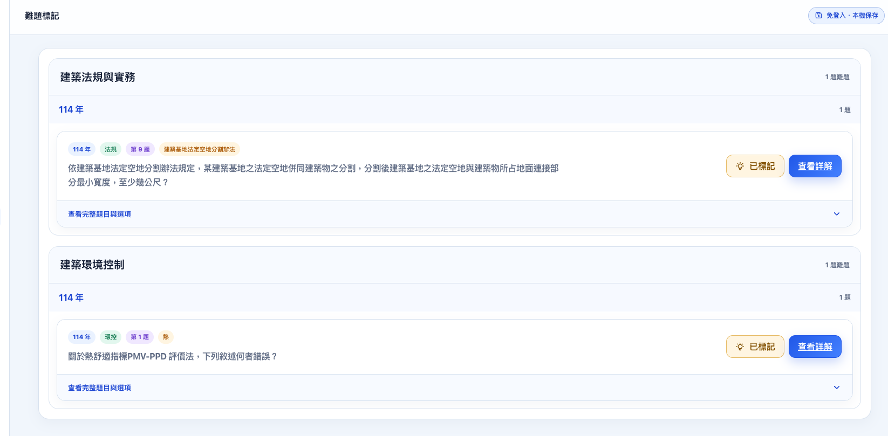 難題標記尚未按照科目分類
- [x] 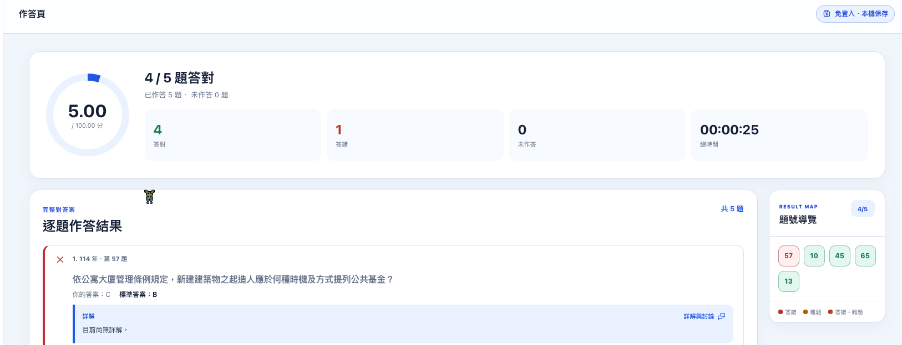 隨機出題不用顯示分數，應該顯示答對題數（依據使用這選擇的題數比例）
- [x] 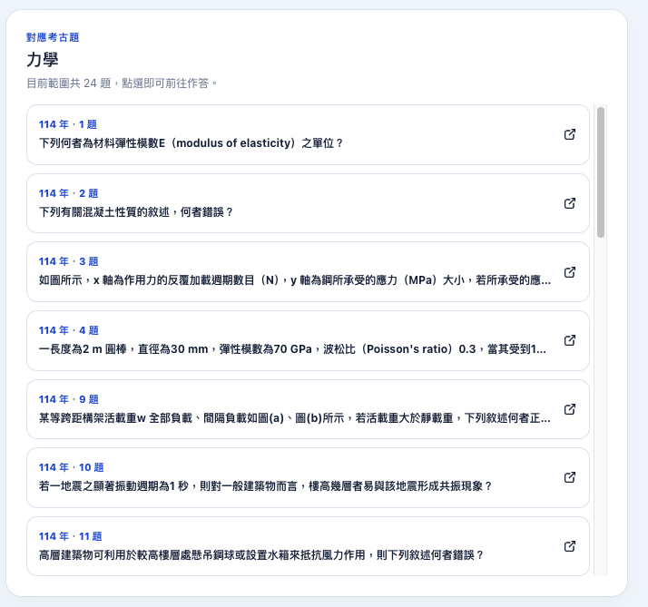 對應考古題單題寫完對答案一樣意思不用顯示分數直接在當頁是否正確即可（不用跳頁面）；再把 113 年題目完整匯入網站，並測試跨年度統計結果
- [x] 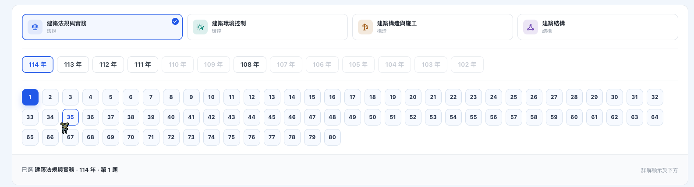 詳解與討論把已經有詳解或討論的題號做特別標記，同時也顯示使用者的難題標記
- [x] 隨機出題新增一個功能：從相同類別的題目隨機出題（比如從歷屆建築技術規則的題目中隨機出五題）
- [x] 作答時新增刪去法功能，可以讓使用者確定錯誤的選項暗去，方便使用者判斷答案
- [x] 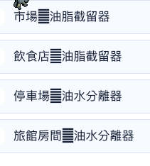 中間出現的符號應該是「-」；已對該題目資料做修正，找到相似錯誤一起修正
- [x] 歷屆試題計時器每到下一題不應該重新計時

## 1.7 - 2026-07-28

- [x]  隨機出題作答紀錄不用紀錄
- [x] 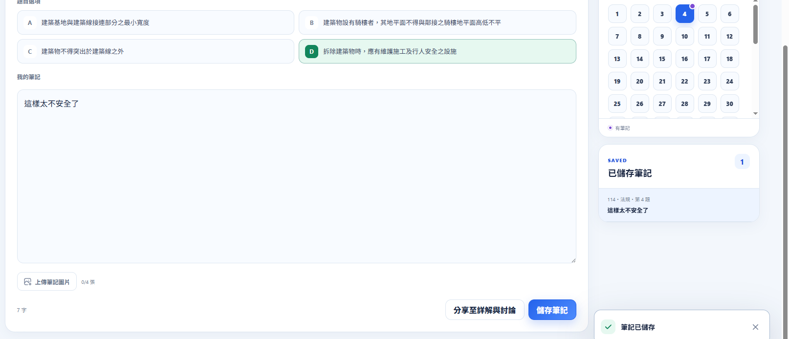 使用者筆記支援刪除
- [x]  第 74 題沒有明確法規分類，應分類為「其他」
- [x] 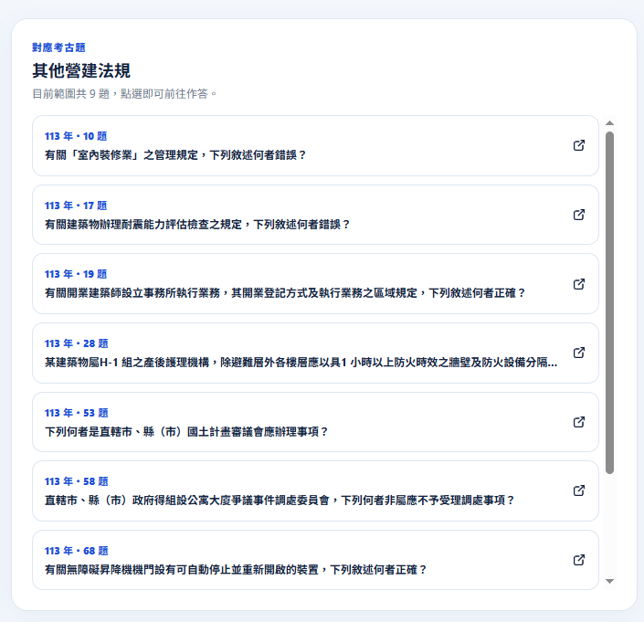 題目分類新增作者可編輯的管理功能，可手動檢核程式判斷與處理未分類題目
- [x] 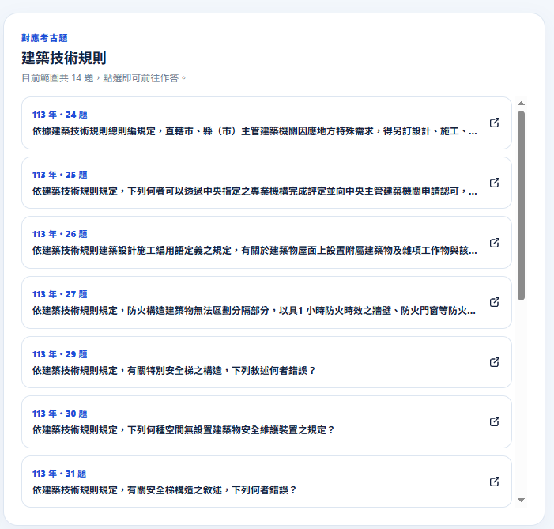 新增「作答全部題目」，可以作答所有相同分類的題目
- [x] 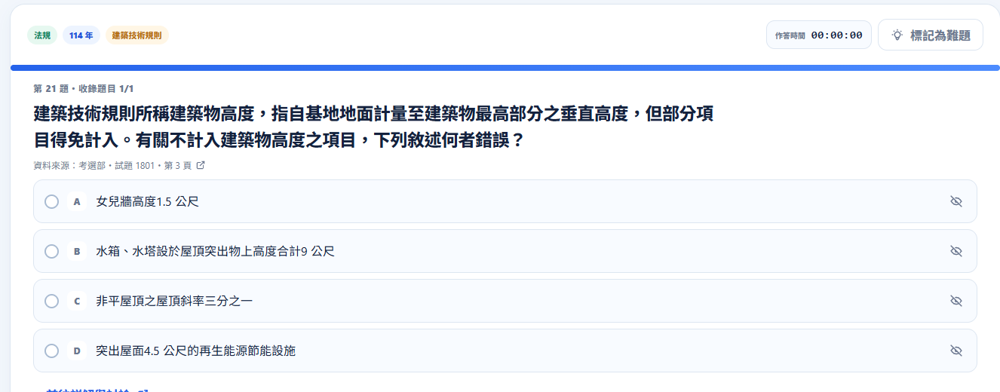 考題分類可以有複數（如果該題有兩種以上法規在內）

## 1.8 - 2026-07-28

- [x] 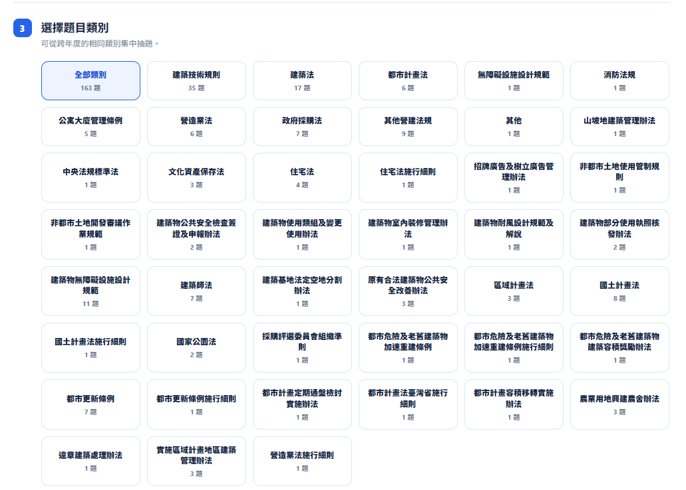 題目類別改為下拉式選擇
- [x]  作者分類管理員直接分類即可，不必分別操作主分類、主題及相關法規

## 1.9 - 2026-07-28

- [x] 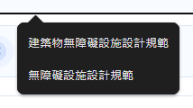 將「建築物無障礙設施設計規範」與「無障礙設施設計規範」整合為「建築物無障礙設施設計規範」
- [x] 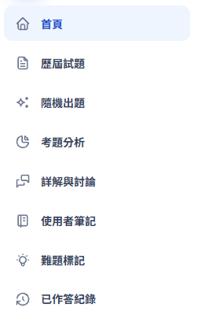 左側功能欄新增「法規資料庫」，把題目曾出現的所有法規建立超連結連到全國法規資料庫

## 1.10 - 2026-07-28

- [x] 跨年度可選年份區間
- [x] 修復使用者筆記題庫載入失敗
- [x] 法規資料庫放在最下面，「???」及「廢止」不用連結，排序按照出題頻率排列

## 1.11 - 2026-07-28

- [x] 修復「詳解與討論」及「使用者筆記」題庫載入失敗
- [x] 法規改為條列式，右側顯示條狀圖比例，方便一目了然

## 1.12 - 2026-07-28

- [x] 左側導覽列改為 App Store 風格的淺灰背景、藍色圖示、緊湊間距與中性灰色選取狀態；保留原有導覽項目、順序、路由及手機抽屜行為。
- [x] 導覽列改版僅調整既有功能的 styling，不新增搜尋欄、搜尋功能、分組或其他互動。
- [x] 作答頁移除線性答題進度條、底部已作答比值及題號導覽中的重複進度；題幹上方只保留一組目前題號進度。
- [x] 題號導覽移除 `STATIC PATHS`，保留目前題、已作答、難題及答錯狀態的既有語意。
- [x] 作答卡改為自然內容高度、白底、14px 圓角、細框與無陰影，避免短題目下方留下大片空白。
- [x] 題幹與選項統一使用 `clamp(16px, 1.1vw, 18px)`、一般字重及相同行高；選項固定一個選項一列。
- [x] 圖片題的題幹欄設定合理最小寬度；空間不足時改為題幹與圖片上下排列，避免題目文字被壓得過窄。
- [x] 資料來源移到作答進度題號上方，作答區最終順序為「資料來源、題號進度、題目、選項」。
- [x] 作答時間移到底部導覽列左側；上一題與下一題／對答案按鈕成組靠右，手機保留 safe-area 與換列處理。
- [x] 標記為難題按鈕改為與題號導覽按鈕一致的扁平細框樣式，並保留難題的黃色狀態。
- [x] 詳解與討論、使用者筆記、難題標記及作答紀錄／結果檢討頁面的題幹與選項統一套用相同的 Apple 風格閱讀字級、單欄選項、白底細框及圓角。
- [x] 跨頁統一後仍保留正確答案、錯誤答案、使用者選取、刪去選項、計時、上下題與題號導覽等既有狀態及功能。
- [x] 詳解與討論及使用者筆記頁的資料來源統一移到題目上方；使用者筆記頁移除可見的「題目選項」標題，並保留無障礙區域名稱。
- [x] 將「標記為難題」抽成全站共用元件，作答頁、詳解與討論及難題清單統一使用作答頁的完整文字、扁平灰底、藍色 hover 與黃色已標記狀態，移除各頁重複樣式及精簡版變體。

## 1.13 - 2026-07-29

- [x] 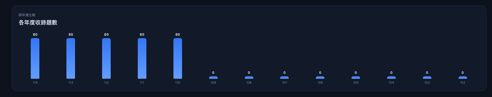 刪除無意義的各年度收錄題數圖
- [x] 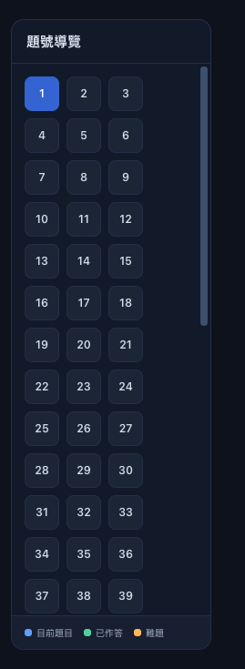 重新調整題號導覽排版，移除右側多餘空間
- [x] 詳解與討論新增管理者可刪除留言與回覆的後台
- [x] 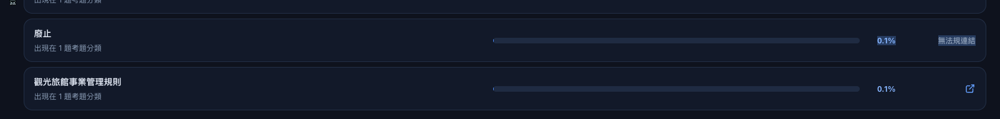  法規資料庫直接移除「廢止」與「???」
- [x] 加入閱讀設定，可分別調整題目與選項字體大小
- [x] 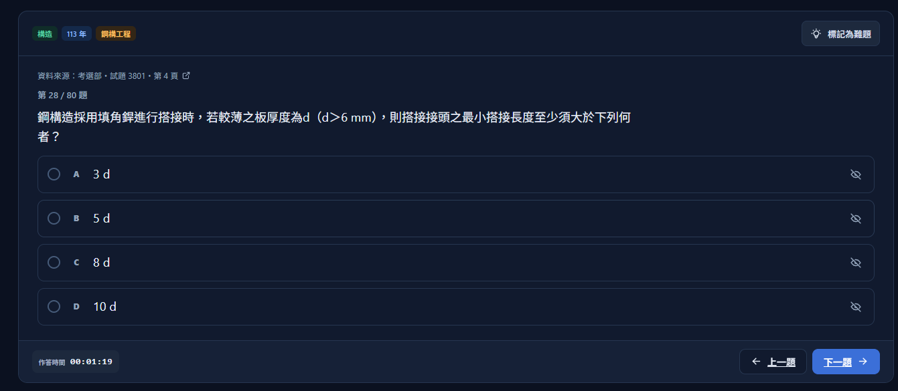 改善題幹換行，避免下一行只剩一、兩個字
- [x] 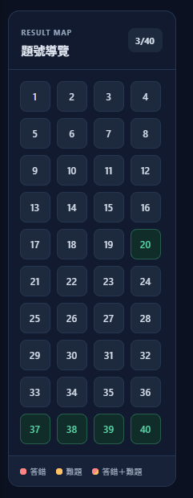 作答結果中的錯題題號顯示紅色
- [x] 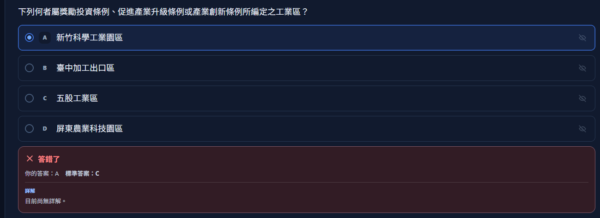 放大並強調標準答案
- [x] 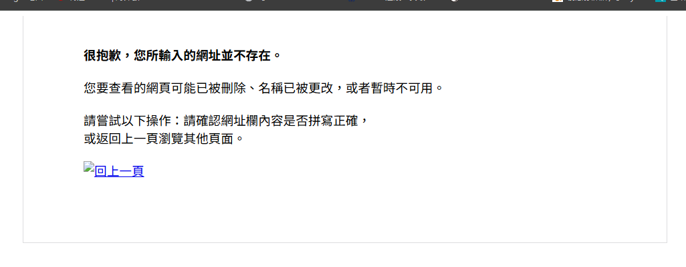 修正 103 年環境控制原始題目連結

## 1.14 - 2026-07-29

- [x] 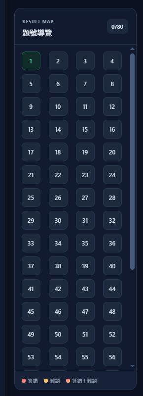 修正作答結果中錯誤題目仍未顯示紅色
- [x] 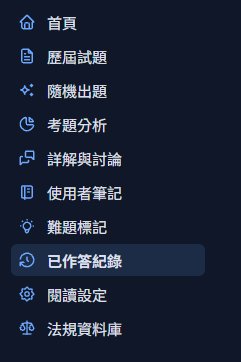 閱讀設定移到側欄最下方，並與主要功能區隔

## 1.15 - 2026-07-29

- [x] 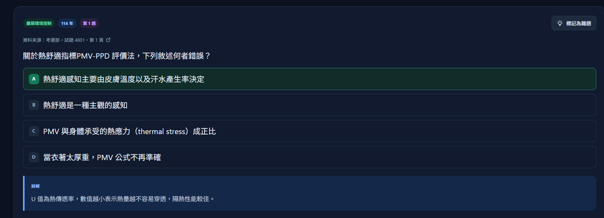 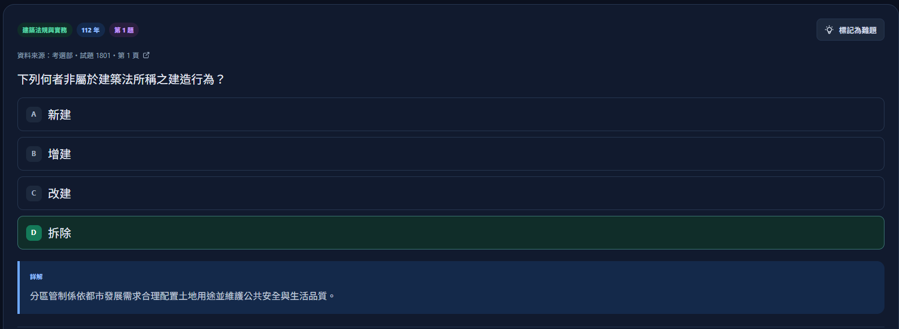 移除所有測試用的題目詳解內容
- [x] 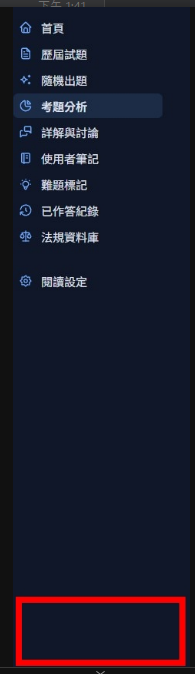 新增問題回報頁面，與閱讀設定固定在側欄底部（閱讀設定在上）
- [x] 確認官方題目詳解會隨網站公開；匿名投稿目前僅儲存在使用者的本機瀏覽器，不會同步給其他使用者
- [x] 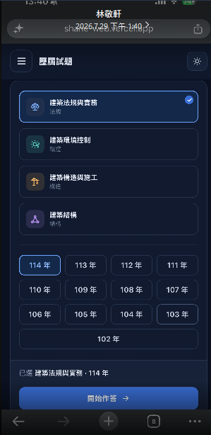 手機版 102 年按鈕維持與其他年度相同大小

## 1.16 - 2026-07-30

- [x]  刪除單題對答案結果中沒有內容的詳解欄
- [x] 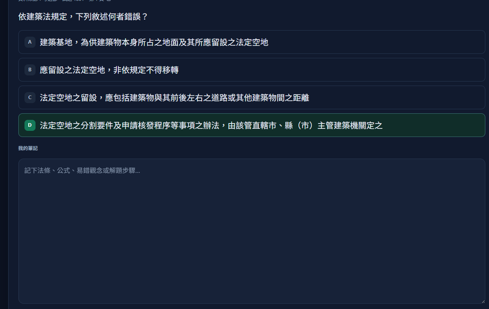 筆記支援直接從剪貼簿貼上圖片，方便加入截圖

## 1.17 - 2026-07-30

- [x] 使用者完成作答後新增錯題類型統計，顯示各分類的答錯題數與題號

## 1.19 - 2026-07-30

- [x] 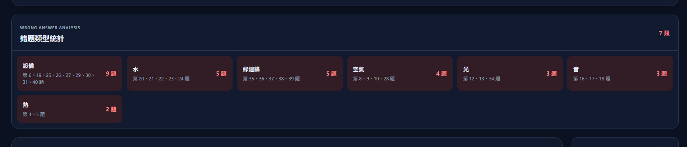 錯題統計設計成分類分頁，選取分類後可以查看該類型的錯題題目、選項、使用者答案與正確答案

## 1.20 - 2026-07-30

1. [x] 錯題統計也要呈現在已作答紀錄裡，每次作答的紀錄內，並且支援跨年度錯題分析
2. [x] 目前錯題分析版面太雜，在上方 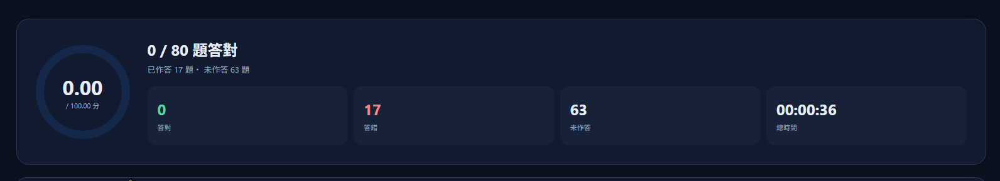 答錯處下面新增「錯題統計結果」，跳至另一個分頁查看，一樣在作答紀錄也這樣呈現

## 1.21 - 2026-08-05

- [x] 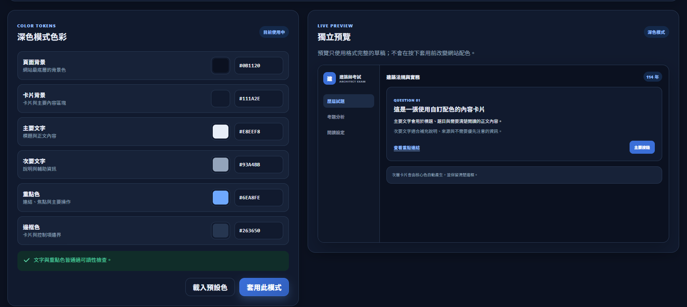  「套用此模式」按鈕固定在上方，模式色彩收合至「進階設定」，並刪除配色設定標題列
- [x] 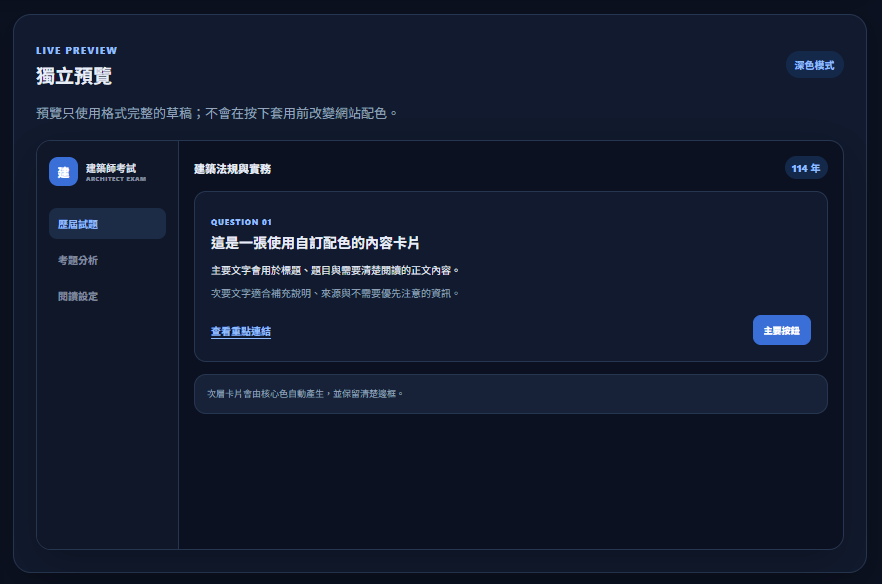 「獨立預覽」改為「頁面預覽」
- [x]  刪除閱讀設定標題列
- [x] 將配色設定與閱讀設定整合成「設定」，內部分為可收合的「閱讀設定」與「介面配色設定」
- [x] 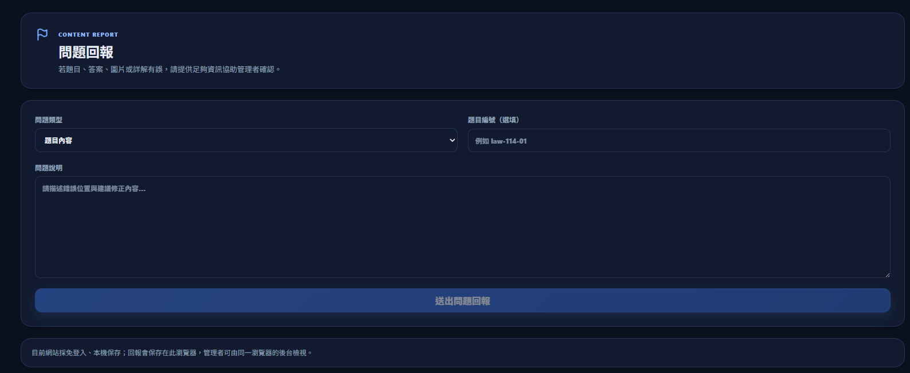 刪除問題回報標題列

## 1.22 - 2026-08-05

- [x] 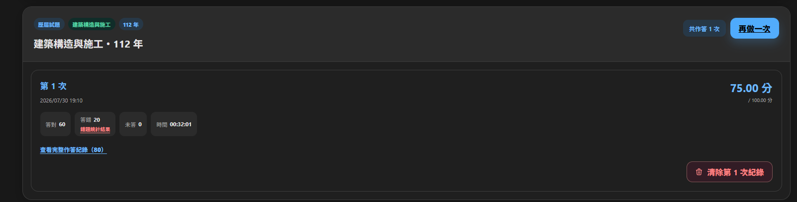 答題記錄裡面，答對答錯未答不用顯示，只留查看完整作答紀錄跟錯題統計結果，版面精簡化
- [x] 詳解與討論投稿改用 Firestore 即時共享，所有使用者可查看，登入後可投稿、回覆、按讚、檢舉及刪除自己的內容（第一階段僅支援文字）

## 1.23 - 2026-08-05

- [x] 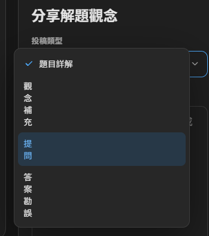 投稿類型選單文字改為水平排列
- [x] 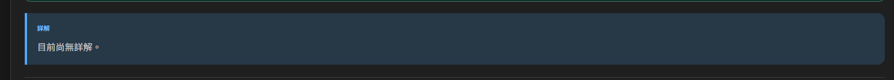 刪除題庫內建詳解區塊，以共享內容為主
- [x] 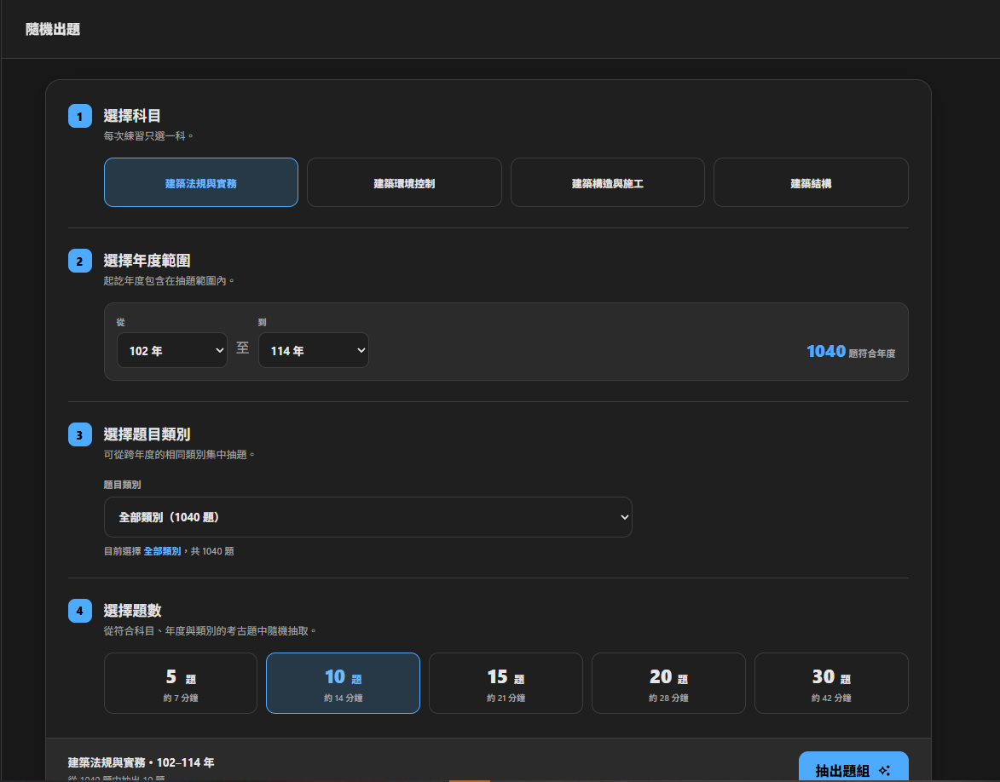 隨機出題設定整合為桌面版單頁可完整瀏覽的緊湊版面
- [x] 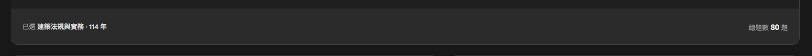 刪除考題分析的選擇摘要列
- [x]  刪除使用者筆記的選擇摘要列
- [x] 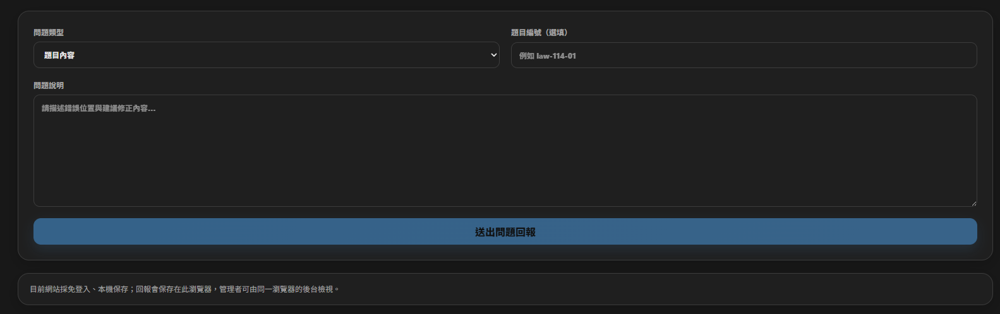 問題回報改為登入後寫入 Firestore，供後端工程師集中查看

## 1.24 - 2026-08-06

- [x] 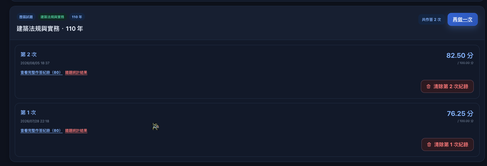 作答紀錄依年份排列，詳細資訊預設收合，只顯示年份與作答次數，展開後才顯示分數與操作
- [x] 使用者文字筆記跟隨登入帳號同步，並修正從對答案與筆記頁分享詳解後未出現在詳解與討論的問題
- [x] 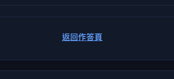 刪除「返回作答頁」連結
- [x]  隨機出題的科目文字維持單行，並修正年度範圍題目數超出框外的排版

## 1.25 - 2026-08-07

- [x]  難題標記跟隨登入帳號同步
- [x]  已儲存筆記依目前選擇的科目與年度篩選
- [x] 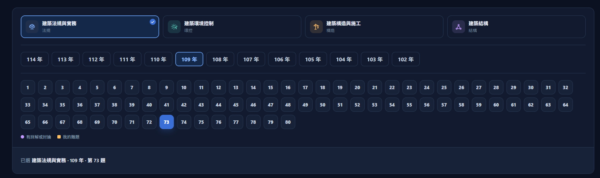 共享投稿成功後確實刊登，所有已有詳解討論的題目皆在題號標記

## 1.26 - 2026-08-09

- [x] 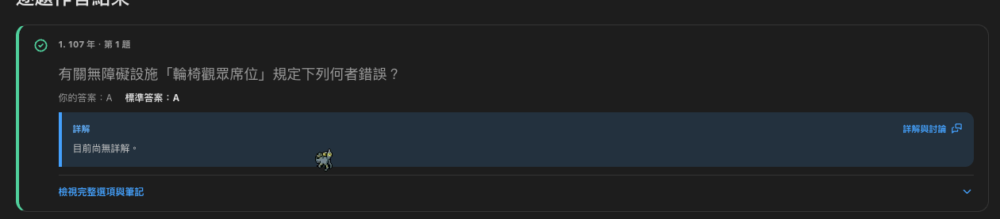 作答檢討移除內建詳解欄位，改為僅顯示前往詳解與討論的連結
- [x]  已作答紀錄移除「全部」分類，直接顯示較大的科目篩選按鈕
- [x] 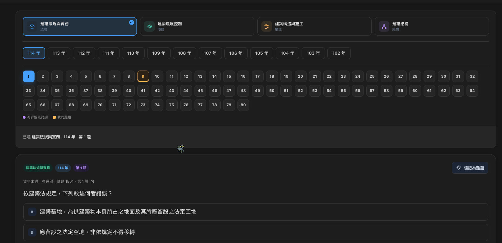 詳解與討論改為題號導覽置右，年份與科目維持於題目上方
- [x] 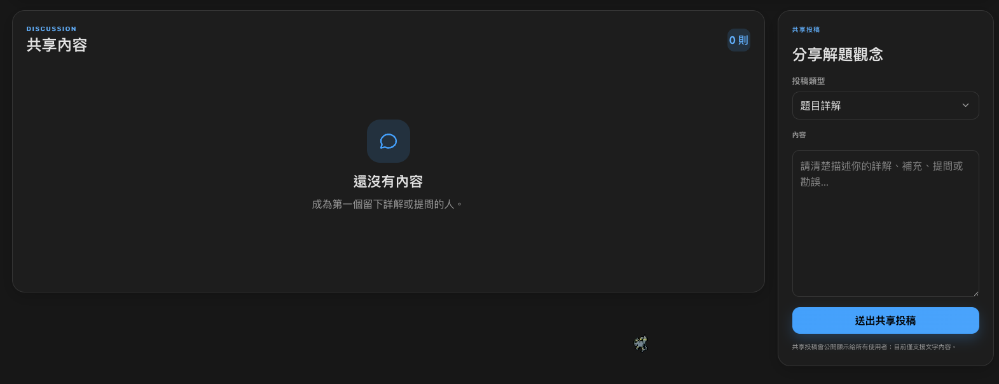 分享解題觀念移至題目下方，並與共享詳解並排
- [x] 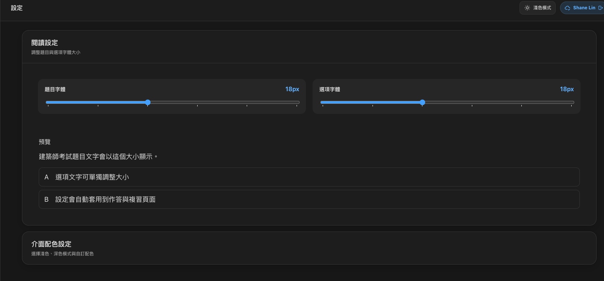 設定改用浮動視窗，關閉後保留原頁面與操作狀態
- [x] 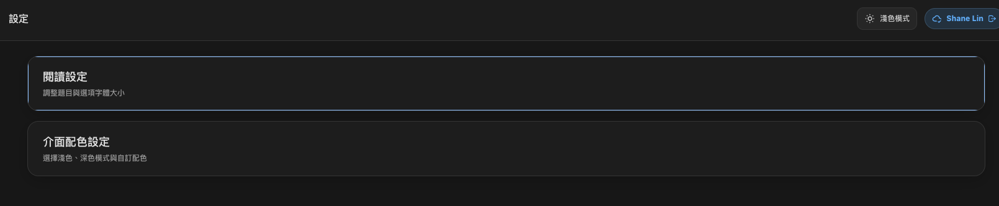 閱讀設定預設收合

## 1.27 - 2026-08-09

- [x] 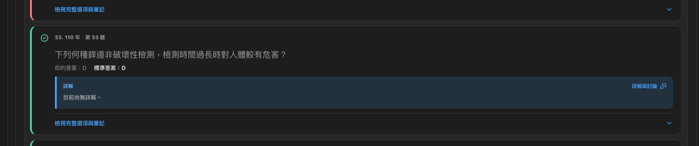 已作答紀錄的逐題結果新增標記與取消難題選項

## 1.28 - 2026-08-09

- [x] 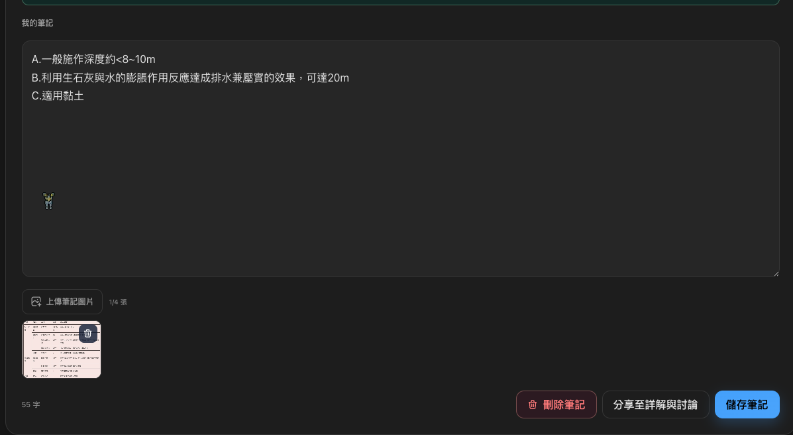 使用者筆記與詳解討論中的圖片可點擊開啟放大檢視
- [x] 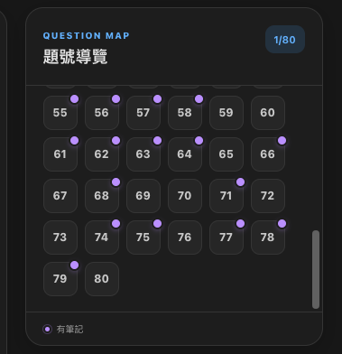 使用者筆記的題號導覽同步顯示難題標記

## 1.29 - 2026-08-11

- [x] 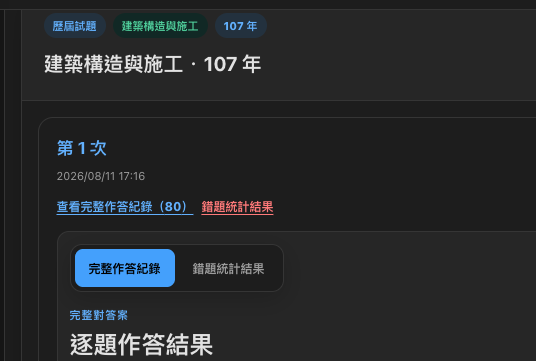 完整作答結果新增明確的收起操作
- [x] 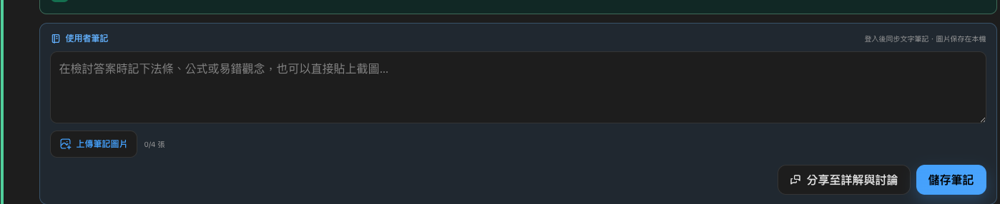 放大使用者筆記輸入區，並加入粗體格式功能
- [x]  詳解圖片支援放大檢視，圖片可正確共享至詳解討論，網址自動轉為超連結
- [x]  作答紀錄底部新增下一個未作答年度入口；完成所有年度後可再練習一個年度

## 1.30 - 2026-08-12

- [x]  修正儲存筆記後分享至詳解與討論沒有反應且未成功刊登的問題

## 1.31 - 2026-08-12

- [x]  上傳共享圖片加入逾時處理，避免介面持續停留在「正在分享」
- [x]  作答檢討改為原頁展開該題詳解與討論，不再使用跳頁連結；尚無內容時顯示提示

## 1.32 - 2026-08-12

- [x]  修正題庫背景載入期間點擊科目沒有反應的問題

## 1.33 - 2026-08-13

- [x]  放大逐題作答結果中的題號資訊
- [x]  右側題號索引跟隨目前檢視的題目並自動捲動

## 1.34 - 2026-08-13

- [x]  使用者討論移除多餘標題文字，直接顯示內容
- [x]  刪除第 16 題重複顯示的題號
- [x]  詳解與討論的題目前顯示題號
- [x]  解題觀念分享欄位移到共享內容下方、加大輸入區並支援粗體
- [x]  自己發布的詳解支援編輯內容

## 1.35 - 2026-08-14

- [x]  修正顯示詳解時文字被擠成直向排列的問題
- [x]  使用者筆記管理頁與逐題作答結果皆加入格式預覽，正確顯示粗體效果

## 1.36 - 2026-08-16

- [x]  改善手機版完整作答紀錄的閱讀排版，並避免題號跟隨功能將頁面持續拉回上方

## 1.37 - 2026-08-17

- [x] 歷屆試題作答新增保留功能，使用者做到一半離開後，下次回到網頁可以繼續完成未完成的題目。
- [x] 檢討題目時如果進入詳解與討論，按上一頁要回到檢討題目頁面，而非一般作答題目。

## 1.38 - 2026-08-17

- [x]  使用者筆記與詳解討論皆顯示該題分類，呈現方式與作答頁一致。

## 1.39 - 2026-08-17

- [x]  移除獨立的格式預覽，文字輸入新增斜體、上標、下標與紅字格式。

## 1.40 - 2026-08-18

- [x]  使用粗體等格式功能時保留輸入區捲動位置，不再跳至最頂。
- [x]  同一使用者分享的詳解不重複刊登，新的修正直接取代原內容。

## 1.41 - 2026-08-23

- [x] 作答紀錄比較同年度每次作答錯題，同題重複答錯時標記累計答錯次數。
- [x] 法規題依題幹與選項語意判斷細分考點，在使用者筆記、詳解與討論底部顯示同考點的類似題目。

## 1.42 - 2026-08-24

- [x]   題庫部分年度載入失敗時，使用者筆記與詳解討論仍可使用已成功載入的題目。

## 1.43 - 2026-08-24

- [x]  修復已作答紀錄題庫載入失敗，縮短單年度題庫在正式環境的讀取時間。
- [x]   使用者筆記與難題標記只載入實際需要的年度，避免其他年度失敗阻斷內容顯示。

### 追加修正

- [x]  作答檢討顯示時即預先讀取各題詳解與討論，展開後直接呈現相關投稿。
- [x]  難題標記分類移除「全部」，預設顯示第一個有標記題目的科目。

## 1.44 - 2026-08-24

- [x]  修正作答紀錄誤判已完成所有年度；做到 105 年後，依題庫收錄順序繼續顯示 104、103、102 年。

## 1.45 - 2026-08-25

- [x]  題號導覽完整顯示不要滾動，並壓縮下方使用者筆記輸入區。
- [x]  修正難題標記裡面分享詳解失敗。

### 追加修正

- [x] 使用者筆記頁的題號導覽移除高度限制與內部捲動，完整呈現該年度所有題號。
- [x] 修正既有詳解更新遭 Firestore 權限拒絕時分享失敗，改以新版替代投稿相容線上舊規則。
- [x] 隨機出題新增「打亂選項」勾選功能；同一題組的選項順序保持穩定，答案仍依原始選項正確計分與保存。

## 1.46 - 2026-09-03

- [x]  難題標記展開後不重複顯示題目，只呈現選項、作答與詳解。
- [x] 難題標記新增重新作答功能，使用者可以直接驗證自己是否已學會。
- [x] 歷屆試題完成後的檢討頁面加入標記與取消難題功能。
